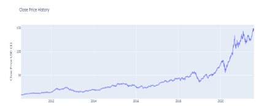

# Dynamic Interactive Stock Dashboard
​
## Development Team
​
* Zeray Admasu - *Dashboard Constructor, Code Reviewer*
* Sumitha Prabu - *NLP -Sentiment Analysis - News Media*
* John A Kelly - *NLP - Sentiment Analysis - Social Media*
* Joanne Gates - *Deep-Learning, LSTM Time Series Analysis*
​
## About This Project
​
The purpose of this project is to create an easy-to-use interactive financial dashboard, intended for a basic, non-professional investors, with little need for tech skills to use, much like the Robinhood app.  The user can call on this dashboard to display real-time information about any SEC publicly-traded stock they are interested in. The dashboard will then output a series of impactful, easy-to-pread visuals:
​
* Historical pricing data.
* Impactful graphs and visuals of the pricing data.
* Time-series price prediction for the target stock.
* Comparative sentiment analysis (both news and social media buzz) about the target stock that could influence a buyer decision.
​
This dashboard will require the user to proivde a **stock ticker** , a **trading period** to return the historical prices covering said timeline. And the built-in python libraries will perform background data scraping and formatting into quick output graphs understandable to the user.  
​
## The Main Dashboard - Zeray Admasu
​
> insert words here. 
​
**Imports and libraries:**
* 
* 
* 
​
​
​
​
## Sentiment Analysis: News Media - Sumitha Prabu
​
> insert words here. 
​
**Imports and libaries:** 
​
​
## Sentiment Analysis: Social Media - John  A Kelly
​
* This section covers more detailed sentiment analysis involving a **social media** source as opposed to an open news source.
* Non-professional investors are overwhelmingly making decisions on emotion and FOMO-related impulses they read about on social media as opposed to objective research. 
* We decided to use **Twitter** as our social media source as we had gotten an approved Twitter developer account that provided the official Twitter API keys, and the Twitter developer portal is very user-friendly.
* When a user queries a stock in the dashboard, it will display the prioces as well as a graph visual of sentiment polarity scores of Twitter users tweeting about the company.
* When the user enterts the stock ticker in the dashboard, the program will also store that ticker into a query variable to pass to the Twitter API.
* Twitter API will scrape Twitter for recent archived tweets on the subject, clean the tweets into direct tokenzied words, and assign polarity and emotional values to those tweets, and finally return a simple plotly graph to the dashboard about people's feelings about the stock.
* So the user has price, price prediction, and sentiment about the stock to make a decision. 
​
**Imports and libaries:**
* tweepy - *pip install tweepy* - This is a library  
* textblob - *pip install textblob* - 
​
​
**STEP 1: Imports**
​
**STEP 2: Store the API keys**
​
**STEP 3: Create a Tweepy 
​
​
​
​
​
​
​
​
​
​
​
​
## LSTM Time-Series Prediction Analysis - Joanne Gates
### LSTM is an artificial recurrent neural network(RNN) used in the field of deep learning, this model is widely used for sequence prediction problems and have proven to be extremely effective. I am going to predict the closing stock price for Apple, using the past 60 day stock price. Data pulled from Yahoo Finance using web.DataReader. Data is from 2011/7/31-2021/7/31. Graphs showing below are using matplotlib, Plotly express and dash. 

### Then I created 80% training data set and 20% testing data set and scale the data set to be values between 0 and 1. My X_train data set contains value from index 0-59(60 days), y_train will be index 60 (61st day). Then build the LSTM model to have 2 LSTM layers with 50 neurons and 2 dense layers with 25 and 1 neurons. Compile the model using MSE (mean squared error) loss function and the Adam optimizer. Then I calculated the RMSE (root mean squared error), the lower the value the better the model performed. My result is 10.66. I polted the real vs. predict graphs in ways using Matplotlib, Plotly express and Dash. The first 3 graphs showing the testing data set real closeing price vs. predicted prices. The last 2 graphs showing the training(train), real(valid) and predicted (predictions) prices. 

### I want to test the model some more and get the predicted closing price value of Apple. for 07/30/21. My predicted value is $ 127.75 the real price is $ 145.86.

> insert words here.
Collapse

Send a message to John A Kelly, Sumitha Prabhu, Zeray Admasu

