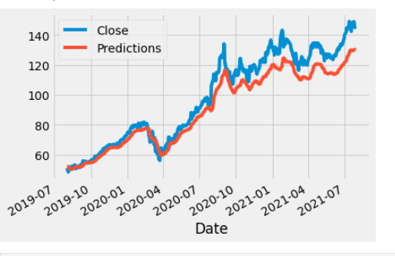
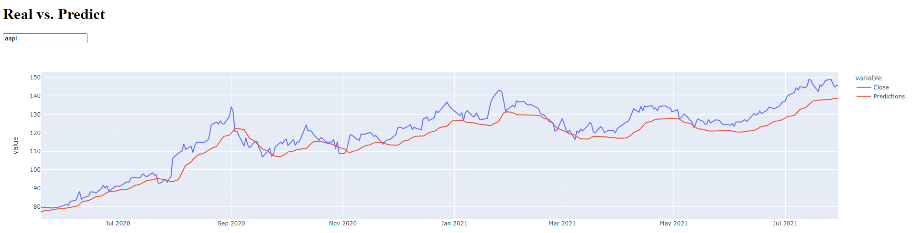
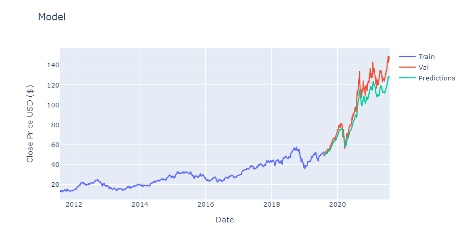
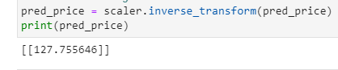

## This part of the project, I am using machine learning(deep learning) technique called Long Short Term Memory (LSTM) to predicts the stock price. I will showing the graphs using 3 diffrent python libraries: Matplotlib, Plotly express and Dash.
### I am using four Jupyter notebooks in this part of the project. 
- lstm.ipynb : I am using deep learning LSTM model to predict the stock price. 
- Dash_prep.py : I am using a define and return function to prepare for my dash code. 
- Dash_1.ipynb : This notebook will show you the dash code to display the stock prices changed over the last 10 years. 
- Dash_2.ipynb : This notebook contained the dash code to display the stock real close price vs. predicted price.  
### LSTM is an artificial recurrent neural network(RNN) used in the field of deep learning, this model is widely used for sequence prediction problems and have proven to be extremely effective. I am going to predict the closing stock price for Apple, using the past 60 day stock price. Data pulled from Yahoo Finance using web.DataReader. Data is from 2011/7/31-2021/7/31. Graphs showing below are using matplotlib, Plotly express and dash. 

### Then I created 80% training data set and 20% testing data set and scale the data set to be values between 0 and 1. My X_train data set contains value from index 0-59(60 days), y_train will be index 60 (61st day). Then build the LSTM model to have 2 LSTM layers with 50 neurons and 2 dense layers with 25 and 1 neurons. Compile the model using MSE (mean squared error) loss function and the Adam optimizer. Then I calculated the RMSE (root mean squared error), the lower the value the better the model performed. My result is 10.66. I polted the real vs. predict graphs in ways using Matplotlib, Plotly express and Dash. The first 3 graphs showing the testing data set real closeing price vs. predicted prices. The last 2 graphs showing the training(train), real(valid) and predicted (predictions) prices. 

### I want to test the model some more and get the predicted closing price value of Apple. for 07/30/21. My predicted value is \ $ 127.75, the real price is \ $ 145.86.

