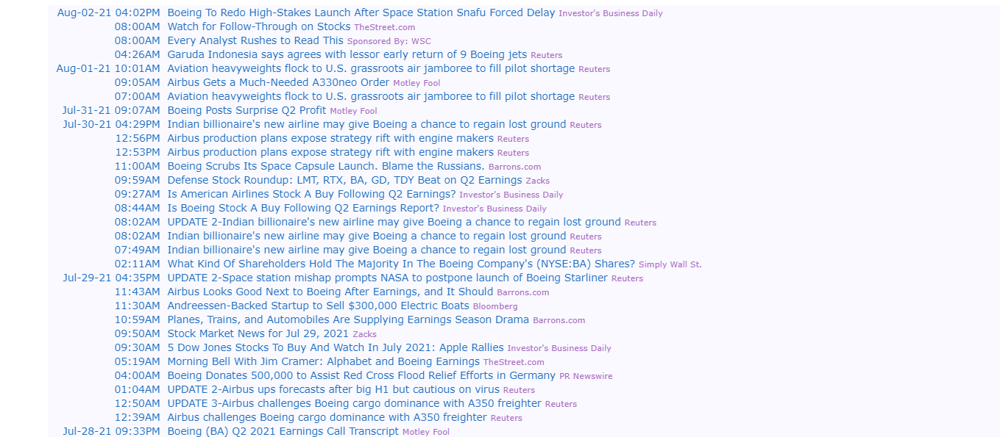
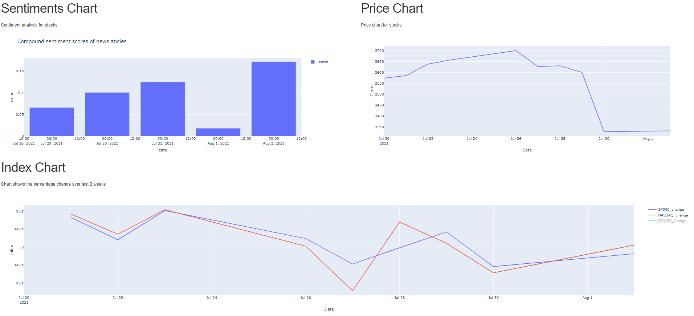

# **Sentiment Analysis for stock news and price trend indicator**

## Steps for the sentiment analysis-price movement.

- ***BeautifulSoup Library***
    - Here BeautifulSoup library is used for webscrapping the news table from the website 'https://finviz.com/quote.ashx?t='
    
    - Using inspect on the webpage we can locate table-id which is then used to scrappe tr (tablerow).
    
    - The news headlines are then converted into a dataframe which is used for sentiment analysis.

    

    
- ***NLTK VADER Library***
    -  NLTK VADER for sentiment analysis is used to find the neutral, postive, negative and compound sentiment for each headline. 
    - The compound values are then aggregated date-wise to get a meanscore dataframe.

- ***Yfinance Library***
    - Yfinance is used to obtain the stock prices for the ticker and S&P500, NASDAQ, DOW30 index closing values.
    - A 2wk (week) period is considered for the price charts so that we can compare the price movements with the sentiment score. 
    - Important to remember that the sentiment score of t0 is seen in the price movement of t1

- ***Dash Plotly Express Library***
    - Plotly express is used to create that charts for sentiment analysis and price movements.
    - Dash app is used to create a web page which can display charts on a web page and the user can interact with the chart and Dash interacts with the python code and displays the updated chart. 

    
    

    

    